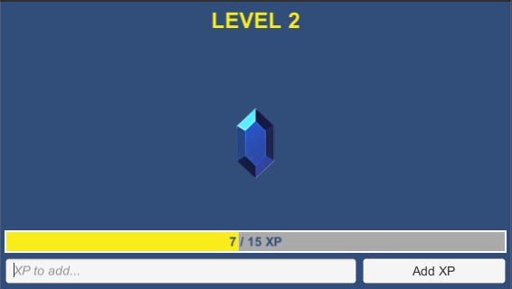
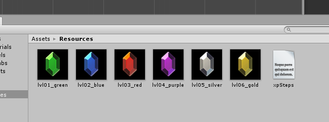

# lvlup
lvlup game for Matze



Modify xpSteps.json in ```lvlup_Data/Resources/``` to change the distribution of XP/levels.
```json
{
  "levelSteps": [
    {
      "xp": 0,
      "imageName": "lvl01_green.png"
    },
    {
      "xp": 5,
      "imageName": "lvl02_blue.png"
    },
    ...
  ]
}
```

This file also references the corresponding images (which are stored in ```Resources``` as well):


You can download a build of the project on the [release page](https://github.com/JonasReich/lvlup/releases).
